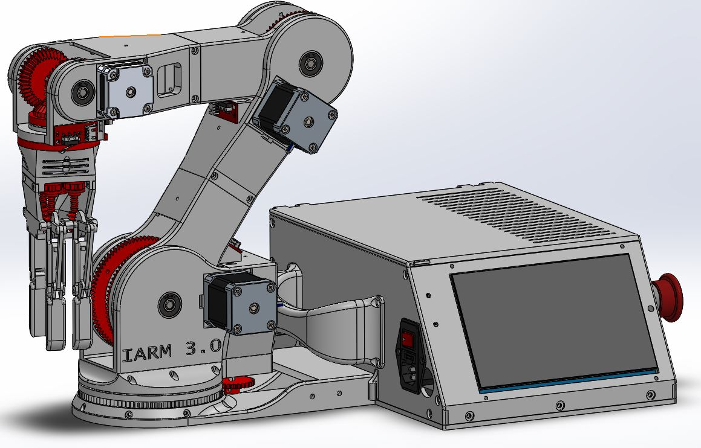
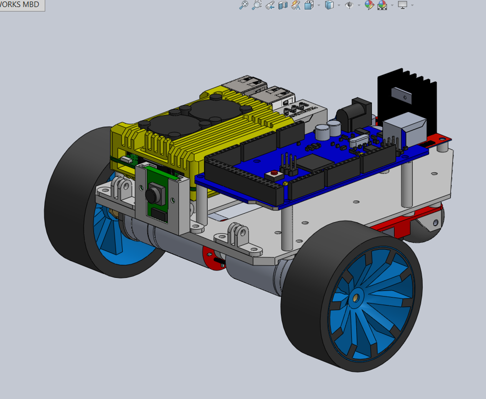
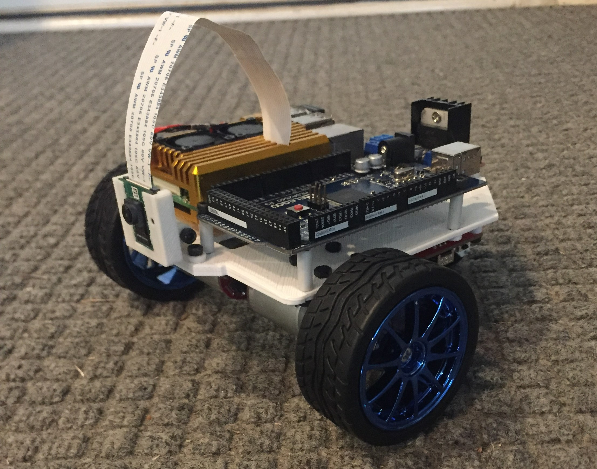

# Welcome to My Project Files

Robotics is my passion. I started building my own contraptions at the age of 14, using mostly plastic construction pieces. One of my earliest designs was a massive [K'nex Robotic Arm](https://www.youtube.com/watch?v=M24NSTdlk6I) that sported basic ultrasonic sensors and hobby servo motors. As the robotics field has grown in capability my intrigue has expanded with it, as chronicled below. 

## I.A.R.M. 3.0 (Interactive Autonomous Robotic Manipulator)

Generation 3 of my Interactive Autonomous Robotic Manipulators (I.A.R.M.), this initiative is my first design fabricated entirely from 3D-printed parts. The end state is to use computer vision and AI to play chess against a human opponent in real-time...and win! To accomplish this, IARM 3.0 boasts 5 degrees of freedom (DOF) powered by stepper motors. All necessary computer vision and artificial intelligence capabilities are handled by an NVIDIA Jetson Nano and [OAK-D stereoscopic camera](https://store.opencv.ai/products/oak-d). 

For position control, the robot kinematics are handled by the ROS MoveIt application which interfaces with the motor drivers through an Arduino Mega 2560. Check out my Youtube [video](https://youtu.be/PcROnV9fZaA) for a quick introduction to the unique design.

## Mobile Prototyping Platform

Combining real-time computer vision with mobile robotic systems turns out to be a real challenge. This miniature mobile robot serves as a prototyping platform for doing just that. A Raspberry Pi/Arduino setup allows for a conservative chassis and low power consumption, while a Picamera provides live video onboard image processing. 

The primary motivation behind this design was to experiment with basic lane navigation techniques. By basic I mean entirely image-processing based; no advanced machine learning or neural networks here. Instead a plethora of basic OpenCV functions and the [RANSAC](https://hands-on.cloud/using-the-random-sample-consensus-ransac-algorithm-in-python/) algorithm were combined to allow the robot to identify lanes in a simple driving environment.
